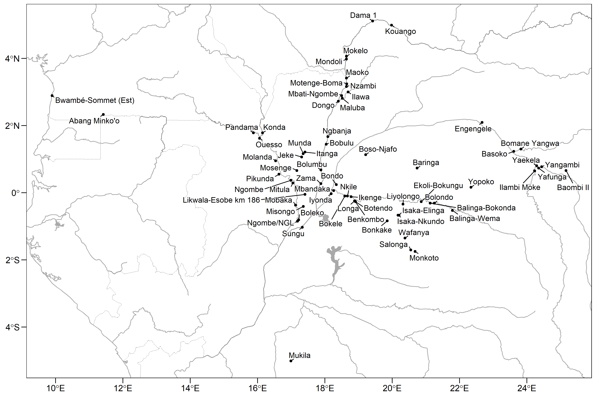

# Investigating Trans-Generational Training Networks in Central Africa: A Multi-Layered Analysis of Pottery Technology (2021-2024)

This repository contains information on the above named research project
at Ghent University, funded by the *Fonds voor Wetenschappelijk
Onderzoek – Vlaanderen* (grant number: **1287922N**) awarded to D.
Seidensticker.

Map of sampled sitese

## Folder and File Structure

- `samples.csv` contains a list of all studied samples and their
  meta-data

## Licenses

**Figures and Tables :**
[CC-BY-4.0](http://creativecommons.org/licenses/by/4.0/)

**Data :** [CC-0](http://creativecommons.org/publicdomain/zero/1.0/)
attribution requested in reuse

**Code :** [MIT License](https://opensource.org/licenses/MIT)
